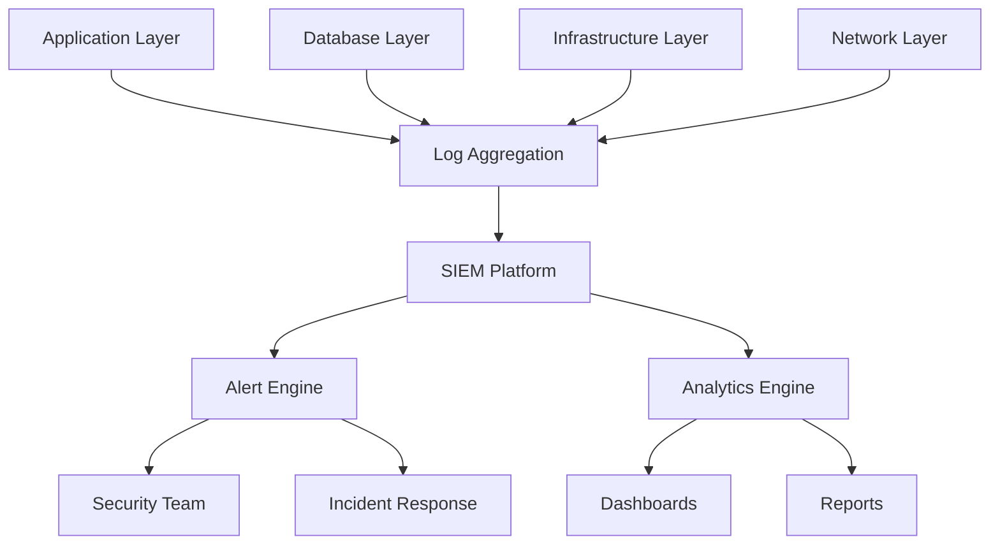

# Security Monitoring & Alerting

## Overview

This document outlines the security monitoring and alerting strategy for the TradePro trading platform, including monitoring requirements, alert configurations, and response procedures.

## Monitoring Architecture

### Current State

- **Status**: ❌ Minimal monitoring implemented
- **Coverage**: Basic application logging only
- **Alerting**: No automated security alerts
- **SIEM**: Not implemented

### Target Architecture



## Monitoring Categories

### 1. Authentication & Authorization

#### Key Metrics

- Failed login attempts
- Suspicious login patterns
- Account lockouts
- Password reset requests
- API authentication failures
- JWT token anomalies

#### Alert Conditions

```yaml
# Failed Login Alert
failed_logins:
  condition: "failed_attempts > 5 in 10 minutes"
  severity: "Medium"
  action: "Alert security team"

# Brute Force Detection
brute_force:
  condition: "failed_attempts > 20 from same IP in 1 hour"
  severity: "High"
  action: "Block IP and alert"

# Impossible Travel
impossible_travel:
  condition: "login from geographically impossible locations"
  severity: "High"
  action: "Lock account and alert"
```

#### Implementation

```typescript
// Authentication monitoring service
class AuthMonitoringService {
  async logAuthEvent(event: AuthEvent) {
    const metadata = {
      userId: event.userId,
      ip: event.ipAddress,
      userAgent: event.userAgent,
      location: await this.getGeoLocation(event.ipAddress),
      timestamp: new Date(),
      success: event.success
    };

    // Log to security monitoring system
    await this.securityLogger.log({
      category: 'authentication',
      event: event.type,
      metadata,
      riskScore: await this.calculateRiskScore(metadata)
    });

    // Check for suspicious patterns
    await this.checkForAnomalies(metadata);
  }

  private async checkForAnomalies(metadata: AuthMetadata) {
    // Check for brute force
    const recentFailures = await this.getRecentFailures(metadata.ip);
    if (recentFailures > 20) {
      await this.triggerAlert('brute_force', metadata);
    }

    // Check for impossible travel
    const lastLocation = await this.getLastLoginLocation(metadata.userId);
    if (this.isImpossibleTravel(lastLocation, metadata.location)) {
      await this.triggerAlert('impossible_travel', metadata);
    }
  }
}
```

### 2. API Security

#### Key Metrics

- API request patterns
- Rate limiting violations
- API key usage anomalies
- Unauthorized API access attempts
- External API response anomalies

#### Alert Conditions

```yaml
# API Rate Limiting
api_rate_limit:
  condition: "requests > 1000 per minute per key"
  severity: "Medium"
  action: "Rate limit and alert"

# API Key Anomaly
api_key_anomaly:
  condition: "usage pattern deviation > 3 standard deviations"
  severity: "High"
  action: "Review and potentially revoke key"

# External API Errors
external_api_errors:
  condition: "error_rate > 20% for 5 minutes"
  severity: "Medium"
  action: "Check API status and alert"
```

#### Implementation

```typescript
// API monitoring middleware
class ApiMonitoringMiddleware {
  async monitor(req: Request, res: Response, next: NextFunction) {
    const startTime = Date.now();
    
    // Log request
    const requestData = {
      endpoint: req.path,
      method: req.method,
      apiKey: this.extractApiKey(req),
      ip: req.ip,
      userAgent: req.get('User-Agent'),
      timestamp: new Date()
    };

    res.on('finish', () => {
      const responseTime = Date.now() - startTime;
      
      // Log response
      const responseData = {
        ...requestData,
        statusCode: res.statusCode,
        responseTime,
        success: res.statusCode < 400
      };

      this.logApiEvent(responseData);
      this.checkApiAnomalies(responseData);
    });

    next();
  }

  private async checkApiAnomalies(data: ApiEventData) {
    // Check rate limiting
    const requestCount = await this.getRequestCount(data.apiKey, 60000); // 1 minute
    if (requestCount > 1000) {
      await this.triggerAlert('api_rate_limit', data);
    }

    // Check for unusual patterns
    const baseline = await this.getApiKeyBaseline(data.apiKey);
    if (this.isAnomalousUsage(data, baseline)) {
      await this.triggerAlert('api_key_anomaly', data);
    }
  }
}
```

### 3. Data Access

#### Key Metrics

- Database query patterns
- Data export activities
- Unauthorized data access attempts
- Bulk data operations
- Sensitive data access

#### Alert Conditions

```yaml
# Bulk Data Access
bulk_data_access:
  condition: "query returns > 10000 records"
  severity: "Medium"
  action: "Log and review"

# Sensitive Data Access
sensitive_data_access:
  condition: "access to PII or financial data"
  severity: "Low"
  action: "Log for audit"

# Unauthorized Access Attempt
unauthorized_access:
  condition: "access denied for sensitive resources"
  severity: "High"
  action: "Alert and investigate"
```

### 4. Infrastructure Security

#### Key Metrics

- System resource utilization
- Network traffic anomalies
- Failed administrative access
- File integrity changes
- Service availability

#### Alert Conditions

```yaml
# Resource Anomaly
resource_anomaly:
  condition: "CPU or memory usage > 90% for 10 minutes"
  severity: "Medium"
  action: "Check for potential DDoS or malware"

# Administrative Access
admin_access_failure:
  condition: "failed admin login attempts > 3"
  severity: "High"
  action: "Lock account and alert"

# File Integrity
file_integrity_violation:
  condition: "unauthorized file changes in system directories"
  severity: "Critical"
  action: "Immediate investigation"
```

## Alert Management

### Alert Severity Levels

#### Critical

- **Response Time**: Immediate (5 minutes)
- **Examples**: Data breach, system compromise, authentication bypass
- **Actions**: Page on-call engineer, activate incident response

#### High

- **Response Time**: 15 minutes
- **Examples**: Brute force attacks, API anomalies, access control violations
- **Actions**: Email and SMS alerts, security team notification

#### Medium

- **Response Time**: 1 hour
- **Examples**: Rate limiting violations, suspicious patterns
- **Actions**: Email alerts, log for review

#### Low

- **Response Time**: 4 hours
- **Examples**: Audit events, compliance logging
- **Actions**: Dashboard notification, daily reports

### Alert Routing

```yaml
# Alert routing configuration
alert_routing:
  critical:
    - pagerduty: security-oncall
    - email: security-team@tradepro.com
    - sms: [+1-xxx-xxx-xxxx]
    - slack: #security-alerts
  
  high:
    - email: security-team@tradepro.com
    - slack: #security-alerts
  
  medium:
    - email: security-team@tradepro.com
    - slack: #security-monitoring
  
  low:
    - dashboard: security-dashboard
    - daily_report: true
```

## Monitoring Tools

### Recommended SIEM Solutions

#### Open Source Options

1. **ELK Stack (Elasticsearch, Logstash, Kibana)**
   - Cost: Free
   - Scalability: High
   - Learning curve: Medium

2. **OSSIM (Open Source Security Information Management)**
   - Cost: Free
   - Features: Comprehensive
   - Community support: Good

#### Commercial Options

1. **Splunk**
   - Cost: High
   - Features: Comprehensive
   - Ease of use: Excellent

2. **LogRhythm**
   - Cost: Medium
   - Features: Good
   - Integration: Excellent

### Implementation Priority

#### Phase 1: Basic Monitoring (Month 1)

```bash
# Setup ELK Stack
docker-compose up -d elasticsearch logstash kibana

# Configure log shipping
filebeat.yml:
  filebeat.inputs:
    - type: log
      paths:
        - /var/log/tradepro/*.log
  output.logstash:
    hosts: ["logstash:5044"]
```

#### Phase 2: Security Analytics (Month 2-3)

```yaml
# Logstash security rules
input {
  beats {
    port => 5044
  }
}

filter {
  if [fields][log_type] == "auth" {
    grok {
      match => { "message" => "%{TIMESTAMP_ISO8601:timestamp} %{WORD:level} %{GREEDYDATA:auth_event}" }
    }
    
    if [auth_event] =~ /failed login/ {
      mutate {
        add_tag => ["security_event", "failed_auth"]
      }
    }
  }
}

output {
  elasticsearch {
    hosts => ["elasticsearch:9200"]
    index => "security-logs-%{+YYYY.MM.dd}"
  }
}
```

#### Phase 3: Advanced Analytics (Month 4-6)

- Machine learning anomaly detection
- Behavioral analytics
- Threat intelligence integration

## Dashboards and Reporting

### Security Dashboard Components

#### Real-time Metrics

```javascript
// Kibana dashboard configuration
const securityDashboard = {
  title: "TradePro Security Dashboard",
  panels: [
    {
      title: "Authentication Events",
      type: "line_chart",
      metrics: ["successful_logins", "failed_logins"],
      timeRange: "24h"
    },
    {
      title: "API Usage",
      type: "heatmap",
      metrics: ["api_requests_by_endpoint"],
      timeRange: "1h"
    },
    {
      title: "Security Alerts",
      type: "table",
      data: "recent_security_alerts",
      limit: 10
    },
    {
      title: "Top Risk IPs",
      type: "bar_chart",
      metrics: ["high_risk_ips"],
      timeRange: "7d"
    }
  ]
};
```

#### Daily Security Report

```typescript
// Automated reporting service
class SecurityReportService {
  async generateDailyReport(date: Date): Promise<SecurityReport> {
    const report = {
      date,
      summary: {
        totalAlerts: await this.getAlertCount(date),
        criticalIncidents: await this.getCriticalIncidents(date),
        authenticationEvents: await this.getAuthEvents(date),
        apiUsage: await this.getApiUsage(date)
      },
      topRisks: await this.getTopRisks(date),
      recommendations: await this.generateRecommendations(date)
    };

    // Send report
    await this.emailReport(report);
    await this.updateDashboard(report);

    return report;
  }
}
```

## Integration Points

### Application Integration

```typescript
// Security event logging
class SecurityLogger {
  static log(event: SecurityEvent) {
    const logEntry = {
      timestamp: new Date().toISOString(),
      level: event.severity,
      category: event.category,
      event: event.type,
      userId: event.userId,
      metadata: event.metadata,
      riskScore: this.calculateRiskScore(event)
    };

    // Send to monitoring system
    winston.info(JSON.stringify(logEntry));
    
    // Send to SIEM
    this.sendToSiem(logEntry);
  }
}
```

### Database Integration

```sql
-- Database audit triggers
CREATE OR REPLACE FUNCTION audit_trigger()
RETURNS TRIGGER AS $$
BEGIN
  INSERT INTO security_audit_log (
    table_name,
    operation,
    user_id,
    old_values,
    new_values,
    timestamp
  ) VALUES (
    TG_TABLE_NAME,
    TG_OP,
    current_setting('app.user_id'),
    to_jsonb(OLD),
    to_jsonb(NEW),
    NOW()
  );
  
  RETURN COALESCE(NEW, OLD);
END;
$$ LANGUAGE plpgsql;

-- Apply to sensitive tables
CREATE TRIGGER user_audit_trigger
  AFTER INSERT OR UPDATE OR DELETE ON users
  FOR EACH ROW EXECUTE FUNCTION audit_trigger();
```

## Performance Considerations

### Log Volume Management

- Implement log rotation policies
- Use log sampling for high-volume events
- Compress and archive old logs
- Implement retention policies

### Resource Optimization

```yaml
# Monitoring resource limits
monitoring_limits:
  log_retention: "90 days"
  alert_retention: "1 year"
  dashboard_refresh: "30 seconds"
  batch_size: 1000
  max_memory: "2GB"
```

## Continuous Improvement

### Monitoring Metrics

- Alert accuracy (true positives vs false positives)
- Response time to security events
- Mean time to detection (MTTD)
- Mean time to containment (MTTC)

### Regular Reviews

- Monthly alert tuning
- Quarterly monitoring effectiveness review
- Annual security monitoring strategy review

---

**Document Control**

- Version: 1.0
- Last Updated: June 1, 2025
- Next Review: September 1, 2025
- Owner: Security Team
